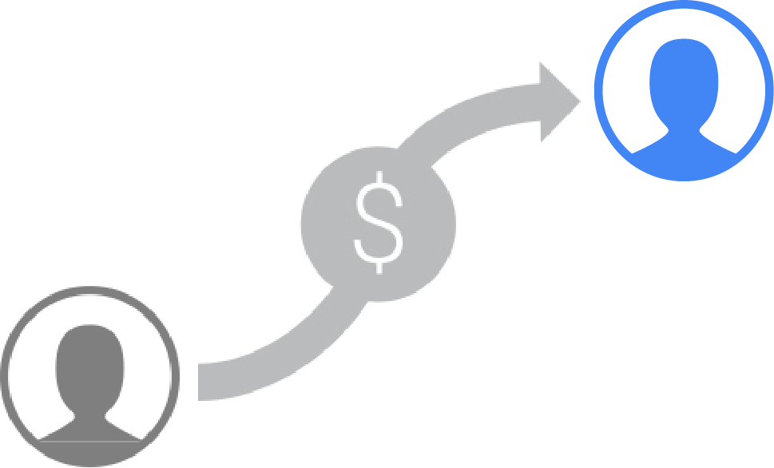

# Revenue Radar

## Dataset Overview

Our dataset contains transaction data from individual visits to the GStore between December 1st, 2018, and January 31st, 2019. Each line in our dataset represents a visit to the store.

The original dataset is available here: https://www.kaggle.com/competitions/ga-customer-revenue-prediction/data?select=train_v2.csv

Originally stored as a JSON file, after transformation, these were the columns available in the dataset:

- `channelGrouping`
- `date`
- `fullVisitorId`
- `sessionId`
- `socialEngagementType`
- `visitId`
- `visitNumber`
- `visitStartTime`
- `continent`
- `subContinent`
- `country`
- `region`
- `metro`
- `city`
- `cityId`
- `networkDomain`
- `latitude`
- `longitude`
- `networkLocation`
- `browser`
- `browserVersion`
- `browserSize`
- `operatingSystem`
- `operatingSystemVersion`
- `isMobile`
- `mobileDeviceBranding`
- `mobileDeviceModel`
- `mobileInputSelector`
- `mobileDeviceInfo`
- `mobileDeviceMarketingName`
- `flashVersion`
- `language`
- `screenColors`
- `screenResolution`
- `deviceCategory`
- `visits`
- `hits`
- `pageviews`
- `bounces`
- `newVisits`
- `transactionRevenue`
- `campaign`
- `source`
- `medium`
- `keyword`
- `adwordsClickInfo.criteriaParameters`
- `isTrueDirect`
- `referralPath`
- `adwordsClickInfo.page`
- `adwordsClickInfo.slot`
- `adwordsClickInfo.gclId`
- `adwordsClickInfo.adNetworkType`
- `adwordsClickInfo.isVideoAd`
- `adContent`
- `campaignCode`

## Project Goals

For our project, we explore two major use cases related to customer conversion and revenue generated from conversions:

1. **Customer Conversion Analysis**: To identify trends in user behavior that lead to conversions, enabling targeted marketing strategies.
2. **Revenue Optimization**: To understand how conversions translate into revenue, providing insights for optimizing ad spend and marketing investments.

Our project aims to explore trends in user conversion, which can drive and improve our investment in marketing and ad spend for GStore, as well as any other retailers looking to leverage customer data to enhance their marketing spend.

Let's dive into the details of each use case for **Revenue Radar**.

---

## Customer Conversion (Use Case 1)

Conversion is a key indicator to understand and optimize, as the number of people purchasing and supporting merchandise maps directly to branding goals.

### Objectives

- Determine which users to target for conversion nudges.
- Increase understanding of the user journey and profile of converting customers.

### Measuring Performance
**Model Performance**
- Model performance should be measured with F1 Score for an appropriate balance of precision and recall.

**Initiative Performance**
- The model must outperform the current rule-based process to be piloted.

Explainable models must be explored throughout the data science process.

### Data Transformations
To facilitate user-centric analysis, the dataset was transformed from session level to user level.

- Page Views -> First Session Page Views, Last Session Page Views
- Device Category -> Number of visits by desktop, mobile, tablet

Columns were excluded based on proportions of missing data and SME (Subject Matter Expert) consultation.

See the code file in the respective labeled folder for more details on preprocessing.

---

## Transaction Revenue (Use Case 2)

Optimizing revenue is critical for sustaining operations and funding the product innovation required for competitiveness in merchandising.

### Objectives

- Identify which customers are likely to spend more at GStore, focusing on understanding their spending behaviors and patterns.
- Determine the key factors contributing to higher customer spending, enabling targeted marketing strategies and product innovation.

### Measuring Performance
**Model Performance**
- Adopted **Mean Absolute Error (MAE)** as our primary metric to evaluate the accuracy of the regression model in predicting customer spending.

### Data Transformations
To facilitate transaction-level analysis, the dataset was filtered for sessions with transaction revenue == 0.

Columns were excluded based on proportions of missing data and use case relevance.

See the code file in the respective labeled folder for more details on preprocessing.